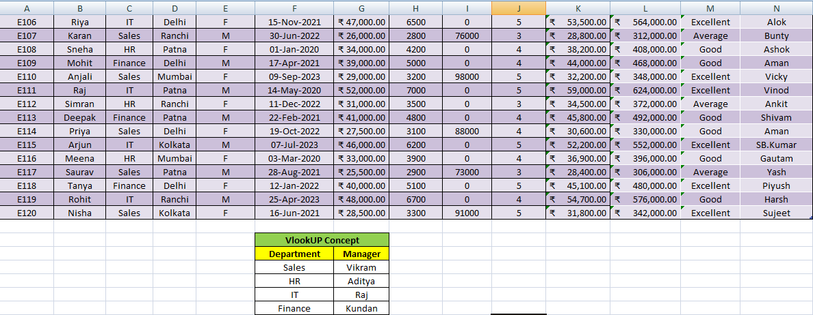

# Employee Data Analysis Dashboard

## Project Overview

This project focuses on employee workforce analysis using Microsoft Excel. The objective was to transform raw employee data into meaningful business insights through data cleaning, calculated fields, pivot table analysis, and reporting.

The project analyzes employee demographics, department performance, salary distribution, bonuses, experience levels, and workforce structure.

## Tools & Techniques Used

* Microsoft Excel
* Pivot Tables
* Data Cleaning
* Text Functions
* Lookup Functions
* IF Functions
* Date Functions
* Dashboard Reporting

## Data Preparation

Several calculated columns were created to enhance analysis:

* Total Income Calculation
* Annual Salary Calculation
* Employee Experience Calculation
* Full Profile Generation
* First Name Extraction
* Last Name Extraction

Data was cleaned and structured for reporting and analysis.

## Analysis Performed

### Employee Demographics Analysis

* Department-wise employee distribution
* City-wise employee distribution
* Gender analysis

### Compensation Analysis

* Salary analysis
* Bonus analysis
* Total income analysis
* Annual salary calculations

### Performance Analysis

* Employee rating evaluation
* Performance categorization
* Experience-based insights

### Department Analysis

* Department-wise salary comparison
* Workforce distribution by department
* Department performance observations

## Key Insights

* IT department recorded the highest average salary.
* Sales department had the highest employee count.
* Employee compensation varied significantly across departments.
* Performance ratings helped identify top-performing employees.
* Experience and income analysis provided workforce insights.
* Department-level analysis supported resource planning and decision-making.

## Dashboard Preview

### Employee Dataset & Calculations

## Skills Demonstrated

* Data Cleaning
* Data Transformation
* Excel Reporting
* Pivot Table Analysis
* Business Analytics
* Workforce Analytics
* Data Visualization

## Project Outcome

Successfully transformed raw employee data into structured analytical reports that provide actionable workforce and compensation insights for management decision-making.

## Author

Balram Kumar

Data Analyst | Excel | SQL | Power BI | Python
